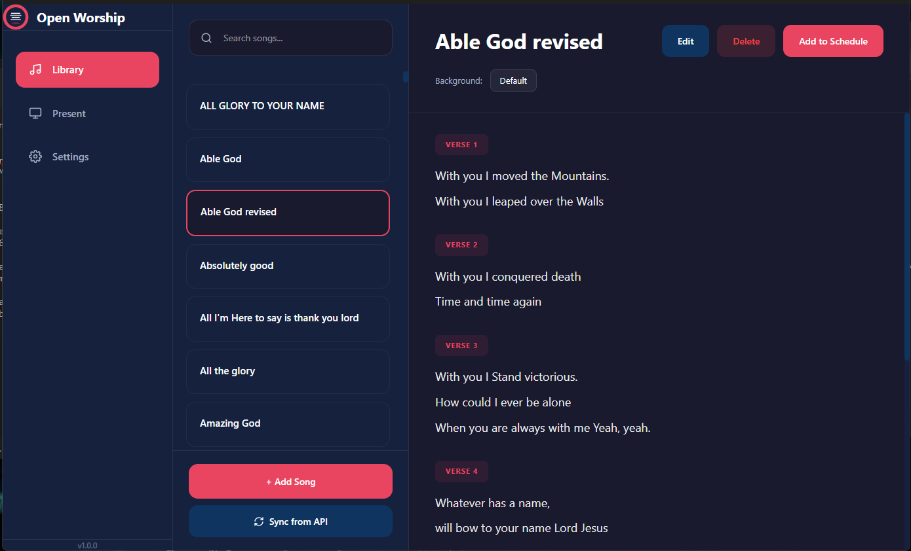
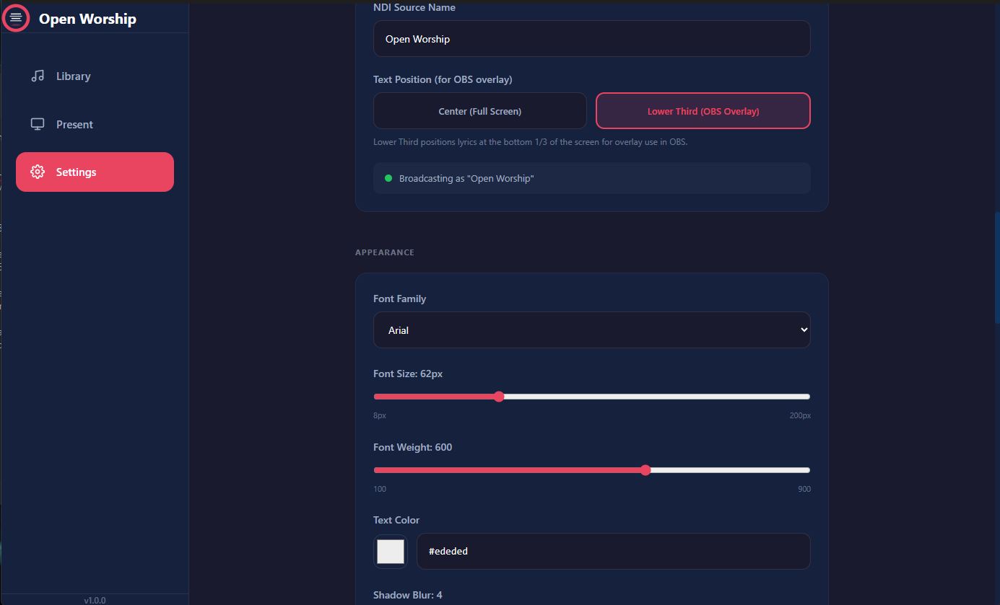

<p align="center">
  
</p>

<h1 align="center">Open Worship</h1>

<p align="center">
  <strong>Free, open-source church presentation software</strong><br>
  Display worship lyrics on screens and livestreams with ease.
</p>

<p align="center">
  <a href="https://github.com/inno8/open-worship/releases">Download</a> •
  <a href="getting-started">Getting Started</a> •
  <a href="user-guide">User Guide</a> •
  <a href="ndi-obs-setup">OBS/NDI Setup</a>
</p>

---

## ✨ Features

| Feature | Description |
|---------|-------------|
| 🎵 **Song Library** | Organize, search, and tag your worship songs |
| 📋 **Service Schedules** | Build setlists ahead of time or on-the-fly |
| 🖥️ **Multi-Display** | Project lyrics to any connected screen |
| 📺 **OBS/NDI Integration** | Overlay lyrics on livestreams with transparency |
| 🔄 **Real-Time Sync** | Connect external apps via WebSocket API |
| 📁 **Easy Import** | Load songs from .txt files |
| ⌨️ **Keyboard Shortcuts** | Fast navigation with Space, arrows, and hotkeys |

---

## 🚀 Quick Start

### 1. Download & Install

Download the latest release for your platform:

- **Windows:** [Open Worship Setup.exe](https://github.com/inno8/open-worship/releases)
- **macOS:** Coming soon
- **Linux:** Coming soon

### 2. Add Songs

Go to **Library** → Click **+ Add Song** → Enter title and lyrics.

**Tip:** Use section markers like `[Verse 1]`, `[Chorus]`, `[Bridge]` to organize your lyrics.

### 3. Build a Schedule

Go to **Schedule** → Create a new schedule → Add songs from your library.

### 4. Present

Go to **Presenter** → Select your schedule → Click **GO LIVE** → Use Space or arrows to advance slides.

---

## 📖 Documentation

| Guide | Description |
|-------|-------------|
| [Getting Started](getting-started) | Installation, first launch, and basic setup |
| [User Guide](user-guide) | Complete guide to all features |
| [Adding Songs](adding-songs) | How to add, import, and organize songs |
| [Building Schedules](building-schedules) | Creating service setlists |
| [Running a Service](running-a-service) | Presenting during worship |
| [NDI & OBS Setup](ndi-obs-setup) | Livestream integration with transparent overlays |
| [Keyboard Shortcuts](keyboard-shortcuts) | Quick reference for all hotkeys |
| [FAQ](faq) | Common questions and troubleshooting |

---

## 🖼️ Screenshots

<p align="center">
  <em>Screenshots coming soon</em>
</p>

<!-- 
When you have screenshots, add them like this:


*Song Library - Organize your worship songs*


*Presenter - Run your service with live controls*


*Settings - Customize fonts, colors, backgrounds, and NDI output*
-->

---

## 💻 For Developers

### Tech Stack

| Component | Technology |
|-----------|------------|
| Desktop App | Electron + React + TypeScript |
| Backend API | Django + Django REST Framework |
| Database | SQLite (local) |
| NDI Output | grandiomedia/ndi |

### Running from Source

```bash
# Clone
git clone https://github.com/inno8/open-worship.git
cd open-worship

# Desktop app
cd desktop
npm install
npm run dev

# Backend (optional, for sync features)
cd backend
python -m venv venv
source venv/bin/activate  # or venv\Scripts\activate on Windows
pip install -r requirements.txt
python manage.py migrate
python manage.py runserver
```

### Contributing

Contributions are welcome! Please read our [Contributing Guide](https://github.com/inno8/open-worship/blob/main/CONTRIBUTING.md).

---

## 📄 License

MIT License — free for personal and commercial use.

---

<p align="center">
  Made with ❤️ for churches everywhere
</p>
